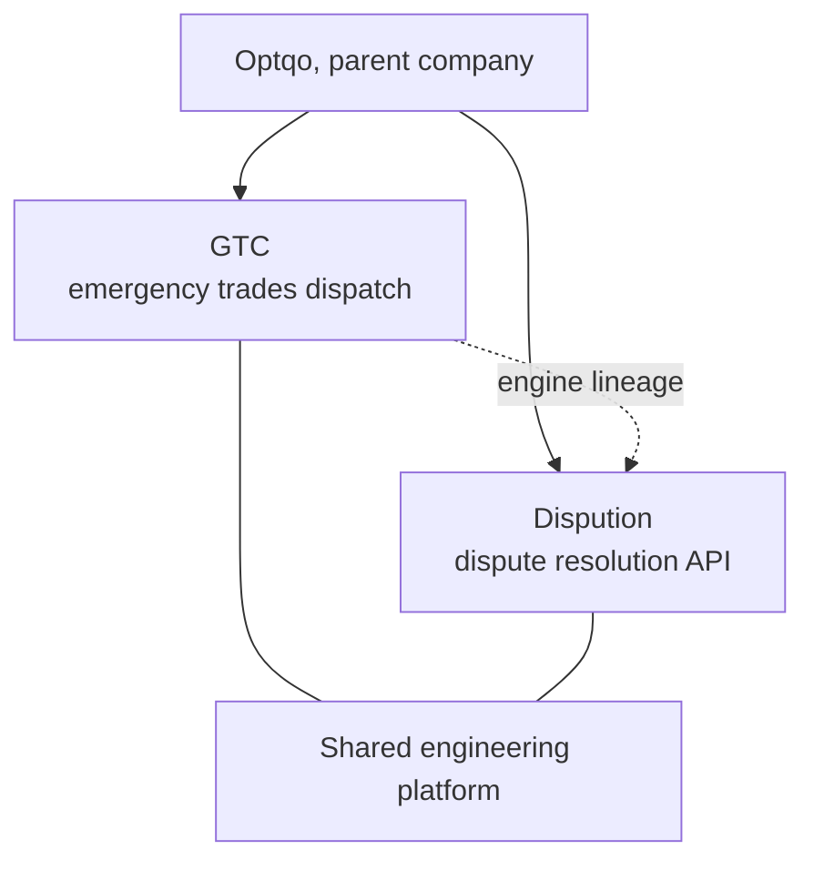
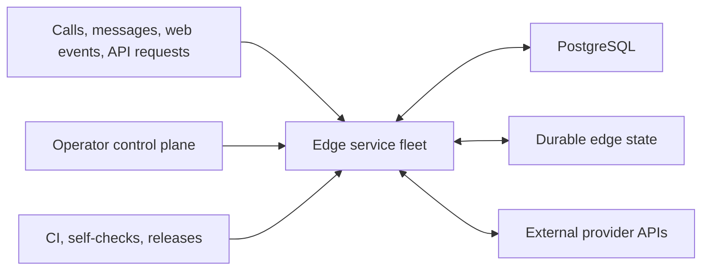

# Optqo

**Optqo** is the parent company behind two software products. I am Anthony, the founder, sole owner, and only human engineer. **Optqo Framework s.r.o.** is the registered company behind both products.

Each product has its own brand and private repository. They share one engineering platform, one set of conventions, and one person responsible for keeping them running.

The private repositories contain the operational details that make the products valuable. This repository gives a high-level view of what we build and how we build it.

## Products

| Product | Brands | What it does | Status |
|---|---|---|---|
| **GTC** | GetTheCall and EmergencyLines | Sends UK homeowners' emergency trade calls to vetted local tradespeople. Trades pay only when a call becomes a booked job. | In production |
| **Dispution** | Dispution | Resolves disputes through a REST API. Send in evidence and the policy; get back a decision, confidence score, and structured proof. | In build |

Dispution grew out of the dispute resolver already running in GTC, where it handles real refund disputes from start to finish.

One naming detail: `optqo` still appears in GTC's internal code, worker names, bindings, and subdomains. That name predates the GetTheCall and EmergencyLines brands, so both names are intentional.

## What I work on

- Event-driven backends and distributed edge services
- Telephony, routing, transcription, and communications
- Payments, reconciliation, and failure recovery
- Identity, verification, compliance, and evidence workflows
- AI-assisted classification with deterministic safeguards
- Operator tooling, observability, and automated recovery
- Secure integrations for communications, payments, advertising, and identity

## The platform

Neither product is a monolith. Each is a group of small services that respond to database events, scheduled jobs, provider webhooks, and operator actions.

| Area | Implementation |
|---|---|
| Runtime | 60+ Cloudflare Workers using modern vanilla JavaScript ES modules |
| Data | Supabase PostgreSQL as the system of record |
| Edge state | Durable Objects, Workers KV, private object storage, and durable queues |
| AI | Native edge inference with cross-provider failover; important decisions use multiple models |
| Integrations | Signed webhooks, service bindings, background jobs, and provider APIs |
| Interfaces | Public web flows, operator dashboards, messaging, and REST APIs |
| Reliability | Idempotency, explicit failure handling, recovery jobs, monitoring, and kill switches |
| Security | Server-side secrets, signature checks, constant-time credential checks, and private evidence storage |
| Delivery | GitHub Actions, automated deployment, SemVer releases, and about 200 self-checks on every push |

The private repositories also contain the architecture docs, service inventories, verification records, runbooks, and deployment automation needed to keep production systems understandable.

## Engineering principles

- Keep services small and boundaries clear.
- Prefer simple code and platform primitives over unnecessary frameworks.
- Treat retries, duplicate events, partial failure, and stale state as normal.
- Fail closed at security and compliance boundaries.
- Protect financial and account actions with idempotency and reconciliation.
- Keep documentation and runnable checks beside the behavior they protect.
- Automate routine work while keeping a human decision point where judgment matters.

## What is not public

The private codebases contain proprietary decision logic, prompts, thresholds, routing rules, data models, provider settings, operational controls, and abuse-prevention measures. They are private by design.

This repository shows the engineering scope, not a blueprint for either product.

## Credits

I currently do all of the product direction, engineering, operations, and documentation.

AI coding agents help me implement, test, review, investigate, and document the work. They are fast and capable collaborators, but the final decisions remain mine. :)
