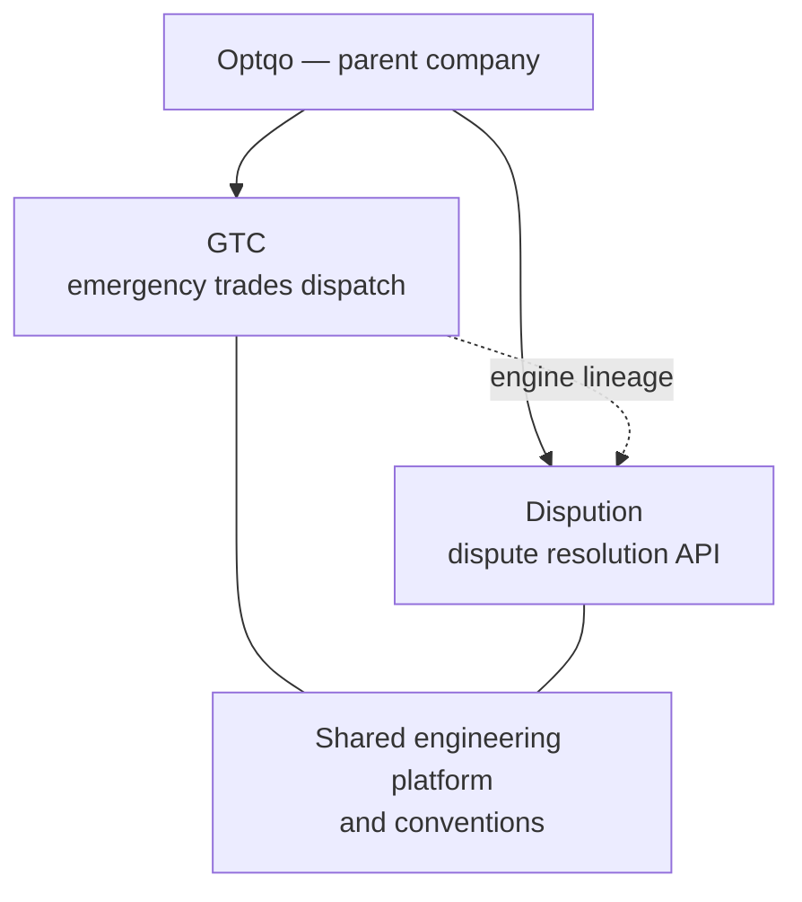
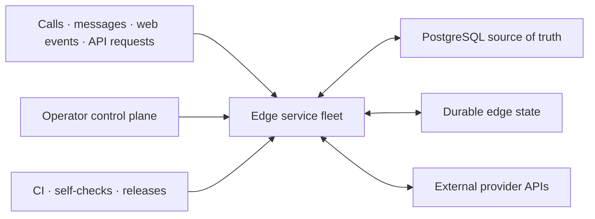

# Optqo

**Optqo** is the parent company. I am Anthony — founder, sole owner, and the only human engineer across everything under it. `Optqo Framework s.r.o.` is the registered entity behind both products; I own 100% of it.

Optqo builds and operates production software. Each product is its own brand and its own private repository; they share one engineering platform, one set of conventions, and one person accountable for them.

The product repositories are private because the value is in the operational logic, not in making that logic easy to copy. This page is the deliberately high-level technical view: what Optqo builds, the engineering surface it covers, and the standards I apply—without publishing either product's playbook.

## Products

| Product | Front-facing brands | What it is | Status |
|---|---|---|---|
| **GTC** | GetTheCall · EmergencyLines (RoofingLine / PlumbingLine / ElectricalLine / HeatingLine) | Pay-per-job emergency dispatch for UK trades. A homeowner calls a local number, the platform dispatches a vetted trade, listens to how the call went, and charges the trade only when the call converts into a booked job—no subscriptions, no recurring fees. | In production |
| **Dispution** | Dispution | Reliable dispute resolution at scale, over a REST API. Evidence plus the policy it should be judged against goes in; a decision, a confidence score, and a structured proof object come back. No human reads the queue. | In build |

The two are related by more than ownership: Dispution's verdict engine is a generalisation of the dispute resolver already running in production inside GTC, where it settles real refund disputes end to end.

A naming note for anyone reading across the estate: `optqo` appears throughout GTC's internal code—worker names, bindings, subdomains—predating the consumer rebrand to GetTheCall / EmergencyLines. Both are correct in their own layer, and the internal name now matches the parent company.

## What I work on

- Event-driven backend systems and distributed edge services
- Real-time telephony, routing, transcription, and communications
- Payment lifecycles, reconciliation, and failure recovery
- Identity, verification, compliance, and evidence-handling workflows
- AI-assisted classification and decision support with deterministic safeguards
- Internal control planes, operational tooling, observability, and automated recovery
- Secure third-party integrations across communications, payments, advertising, and identity

## The platform, technically

Neither product is a monolith. Each is a fleet of small, independently deployable services reacting to database triggers, scheduled work, provider webhooks, and operator dashboards.

| Area | High-level implementation |
|---|---|
| Runtime | 60+ Cloudflare Workers across the two products—modern vanilla JavaScript ES modules, no application frameworks and no runtime npm dependencies |
| System of record | Supabase PostgreSQL with database events, scheduled work, and realtime consumers |
| Edge state | Durable Objects, Workers KV, private object storage, and durable queues |
| AI | Native edge inference with cross-provider failover through a gateway; consequential decisions go to multi-model panels rather than a single model |
| Integration style | Signed webhooks, internal service bindings, background jobs, and provider APIs |
| Interfaces | Public web flows, authenticated operator dashboards, messaging surfaces, and public REST APIs |
| Reliability | Idempotent operations, explicit failure modes, recovery jobs, health monitoring, and kill switches |
| Security | Server-side secrets, signature verification, constant-time credential checks, and private evidence storage |
| Delivery | GitHub Actions, automated deployment, SemVer release on every merge, and ~200 dependency-light self-checks gating every push |

The private repositories also contain the supporting architecture documentation, database and service inventories, design notes, verification records, operational runbooks, and deployment automation required to keep a production system understandable.

## Engineering principles

- Keep services small and ownership boundaries clear.
- Prefer platform primitives and simple code over unnecessary frameworks.
- Treat retries, duplicate events, partial failure, and stale state as normal operating conditions.
- Fail closed at security and compliance boundaries.
- Put irreversible financial or account actions behind idempotency and reconciliation.
- Keep documentation and runnable checks beside the behaviour they protect.
- Automate routine operations while preserving a human decision point where judgement matters.

## What is intentionally not public

The private codebases include proprietary decision logic, prompts, thresholds, routing rules, data models, operational controls, provider configuration, and abuse-prevention measures. Those details are omitted here on purpose.

This repository is a window into the engineering scope—not a blueprint of either product.

## Credits

I am currently the only human contributing to Optqo and its products. I design, build, operate, and take responsibility for the systems.

AI coding agents help me implement, test, review, investigate, and document the work. They are capable collaborators and very fast typists; the product direction and final decisions remain mine. :)
